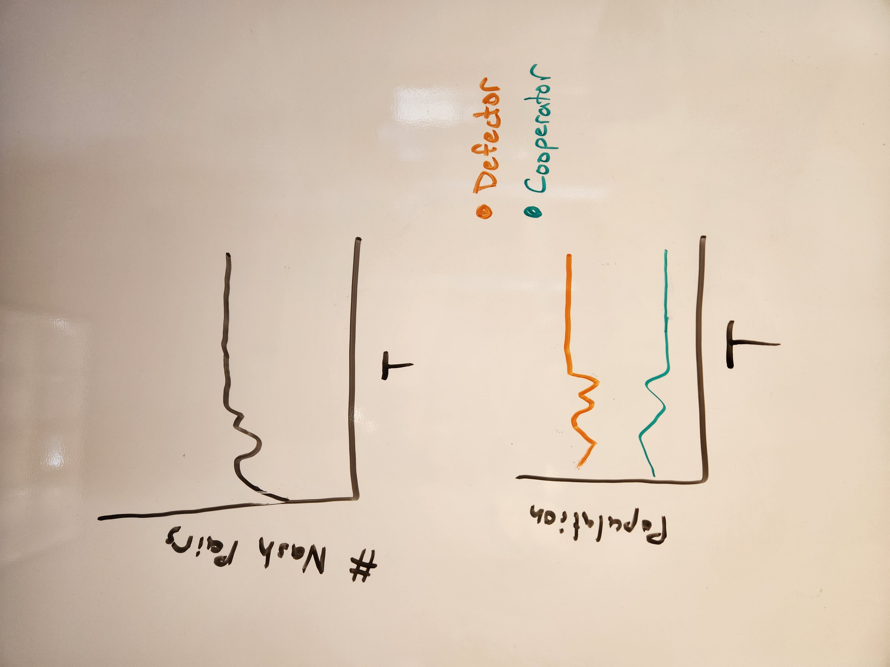

# Local Nash Equilibrium of Prisoner's Dilemma in WS & BA Networks

By: Trinity Lee and Daniel Quinteros

## 2) An abstract that identifies the topics you intend to investigate and the tools you plan to use.

Our goal for this project is to investigate the local Nash Equilibrium phenomenon in social networks by simulating the Prisoner’s Dilemma Game. These simulations will integrate two types of networks: Watts and Strogatz small-world networks (WS) and Barabasi and Albert scale-free networks (BA). We intend to utilize the Python network tool created by Allen Downey for this purpose.

## 3) An annotated bibliography of 1-3 papers that relate to your topic and/or tools.  Explain what the papers are about, what experiments they report, and what their primary conclusions are.

The main paper we will be referencing for our project is called [“Local Nash Equilibrium in Social Networks”](https://www.nature.com/articles/srep06224.pdf#:~:text=The%20local%20Nash%20equilibrium%20provides%20a%20way%20to,evolutionary%20stable%20state%20for%20the%20Prisoner%E2%80%99s%20dilemma%20game). 

This paper investigates two different imperfect information games, The Prisoner’s Dilemma and the Snow Drift/Hawk-Dove/Chicken, and sees how an evolutionary stable state emerges (using local Nash equilibrium to measure) when these two games are placed in a small world (WS) and scale-free (BA) networks. The paper measures the percentage of Nash pairs (two agents who reach Nash equilibrium with each other) within a network and the frequency of cooperators (a potential outcome role within each game) in the entire system. For the purposes of our project, we will mainly be focusing on their methodologies and findings in regards to the Prisoner’s Dilemma Game (PDG). In the Prisoner’s Dilemma Game, there are two strategies/roles an agent can choose: Cooperator or Defector.

For the PDG, the authors defined 4 parameters that influenced agent-based behavior:
- T (temptation to defect) for defecting a cooperator
- R (reward for mutual cooperation) for cooperating with a cooperator
- P (punishment for mutual defection) for defecting a defector
- S (sucker’s payoff) for cooperating with a defector. 

Furthermore, they generate several mathematical representations of the different laws used to dictate agent behavior throughout this simulation. For updating these laws per timestep, they utilize two different approaches, Nowak & May and Santos & Pachecos. 

Throughout the simulation, the number of Nash pairs and number of cooperators & defectors are kept track of to understand what is the best personal strategy for survival given different parameter values, networks, and update laws. 

They use Local Nash equilibrium to judge whether a gaming structured population reaches the evolutionary stable state and predict whether cooperation can exist in a system long before the system reaches its evolutionary stable state. Their model provides a potential explanation as to why the system exhibits a relatively stable state when the number of local Nash equilibriums reaches the minimum. For the PDG, they found that once the fraction of Nash pairs in the connected individuals decays with time, cooperators can survive in its evolutionary stable state. If cooperators can survive in the system, the system reaches its evolutionary stable state when the fraction of Nash pairs reaches its minimum. This is because these Nash pairs actually protect cooperative behavior. If all the defectors are in Nash pairs, then it cuts these defectors’ payoffs and enables cooperation to survive in a circumstance with a large temptation to defect. Overall, the paper proves that a local Nash equilibrium is a typical feature of the cooperative structured populations. 

## 4) Present 1-3 experiments from these papers that you plan to replicate and 1-3 extensions or variations of those experiments you are considering.

From the paper above, our intention is to reproduce the experiment examining the conditions under which a system reaches the evolutionary stable state when individuals play the Prisoner’s Dilemma game. The experiment’s variables include the type of network being used (WS or BA), the values assigned to the four parameters that influence agent-based behavior, and the updating rule utilized. Possible extensions to the experiment involve incorporating another form of complex network.

## 5) Sketch what the results from these experiments might look like, possibly using a cartoon of a graphical result.

## 6) Explain how you will interpret the results; for example, "If the power spectrum on a log-log scale is approximately linear, we will estimate its slope.  If that slope is near 1, we will conclude that the time series generated by model resembles pink noise."

We will be interpreting the number of defectors and cooperators over time and the number of Nash pairs in the simulation as the simulation attempts to reach an evolutionary stable state given different parameter values, updating laws, and networks. If the number of nash pairs remains high and steady, we will conclude the model is in the nash equilibrium.

We will also attempt to recreate their graphs when doing parameter sweeps for the parameter T and it’s impact on the number of defectors, cooperators, and nash pairs over different timesteps. 

## 7) Identify causes for concern.  Review the criteria for what makes a good project and identify any areas where your project might be problematic.

Overall some of the main causes for concern is the scope and complexity of this project as well as being able to implement the simulation correctly without getting too confused with the nuances of their experiment. One of the issues with their approach is that they use Nash pairs to measure the evolutionarily stable state of the network. This is a concern because it is not a straightforward way of measuring whether the system has approached a permanent stable state. They use Nash pairs as a measurement because you can hardly tell the difference between the temporary and permanent stable state in a few time steps. Hence, if you relied on measuring the fraction of cooperators (or defectors) to check whether the network had reached a permanent stable state, it wouldn’t work. This is because the number of cooperators may be stabilized at a particular value with a small fluctuation before the system reaches the evolutionary stable state. Thus, the very interpretation of the results is extremely complex and has a lot of implied evidence. We need to take their word for their reasoning on how they decided to measure certain things, and that could potentially become a problem. 

## 8) Outline next steps.  For each team member, what do you plan to work on immediately?  What do you think you can do for the team in the first week?  Consider using GitHub Projects to make a kanban board to track tasks.

1. Build/modify infrastructure for WS and BS graphs
2. Write code that manages all the different parameters and updating rules for the agents 
3. Write code that integrates everything and runs the simulation, outputting the results
4. Create graphs in MatPlotlib to display findings
5. Organize into a jupiter notebook

